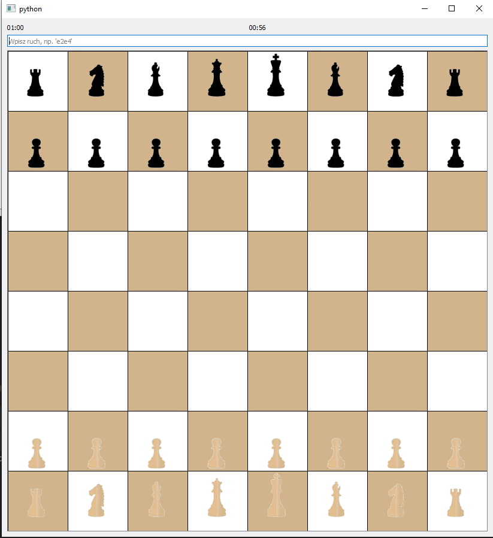
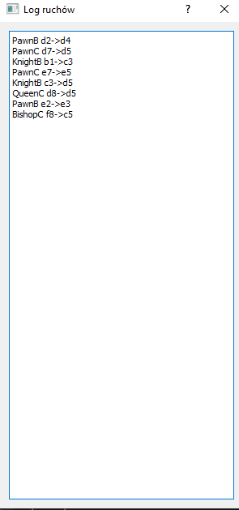

# Chess Game

This is a PyQt5-based chess game application that offers a fully interactive and visually rich chess experience. It supports single-player, two-player, networked multiplayer modes, and an AI opponent. The project includes features like move validation, a game log, a time clock for each player, and intelligent AI move suggestions. The game adheres to all standard chess rules, including special moves such as en passant, castling, and pawn promotion.

---

## Features

- **Interactive GUI**: The chessboard and pieces are rendered using PyQt5, allowing users to play directly on the board.
- **Move Validation**: Validates each move based on chess rules, including special moves like castling, en passant, and pawn promotion.
- **Timer**: Each player has a customizable time clock with additional time added after each move.
- **Game Modes**:
  - Single-player with AI opponent.
  - Local multiplayer.
  - Online multiplayer using a network connection.
- **Move Log**: Displays the history of moves in a separate log window.
- **AI Opponent**: Implements move evaluation and decision-making for single-player mode.
- **Persistence**:
  - Save and load game states to a database or XML format.

---

## How to Play

### Single-player
- Select "1 Player" or "AI" mode from the settings dialog.
- Choose a time control and start the game.

### Local Multiplayer
- Select "2 Players" mode.
- Two players take turns interacting with the chessboard.

### Online Multiplayer
- Start as either a server or client:
  - Enter the IP address and port to connect or host.
  - Select the "2 Players" mode.

---

## File Structure

- **main.py**: Entry point of the application.
- **chess_game.py**: Main game logic and UI integration.
- **chess_board.py**: Logic for the chessboard and piece placement.
- **pieces/**: Classes for individual chess pieces (Pawn, Rook, Knight, Bishop, Queen, King).
- **network_manager.py**: Manages server and client communication for multiplayer mode.
- **datamanager.py**: Handles database and XML operations for saving/loading game states.
- **logWindow.py**: Manages the game log window.
- **resources_rc.py**: Contains resource assets for the GUI.
- **time_select_dialog.py**: Handles game settings such as time control and game mode.

---

## Additional Features

### Rules Compliance
This application strictly adheres to all official chess rules:
- Legal moves are validated for all pieces, including pawns, rooks, knights, bishops, queens, and kings.
- Special moves such as:
  - **Castling**: Supported under the standard conditions.
  - **En Passant**: Automatically detected and executed when applicable.
  - **Pawn Promotion**: Promotes to any piece of the player’s choice (default to queen).
- Detection of check, checkmate, and stalemate.

### Visual and Gameplay Enhancements
- **Highlights**: Valid moves are highlighted when a piece is selected.
- **Drag and Drop**: Intuitive piece movement using drag-and-drop functionality.
- **Customizable Timer**: Time control options ranging from blitz to classical formats.
- **AI Move Evaluation**: AI opponent uses heuristic evaluation and minimax with alpha-beta pruning for move decisions.

### Data Management
- **Game History**:
  - Games can be saved and reloaded from a database or XML file.
  - Move logs are displayed in a clear, readable format.

---

### Screenshots

Here are some screenshots showcasing the application:

*Screenshot of the chessboard and gameplay, highlighting the timer and input box.*

*Screenshot showing the move log window with moves recorded step-by-step.*

## Future Development

Planned improvements include:
- **Online Matchmaking**: A lobby system for easier player connections.
- **Improved Graphics**: Additional themes and board customization.
- **Mobile Compatibility**: Expanding the application to support mobile devices.
- **Advanced AI**: Enhancing the AI engine with machine learning techniques for stronger gameplay.

---
